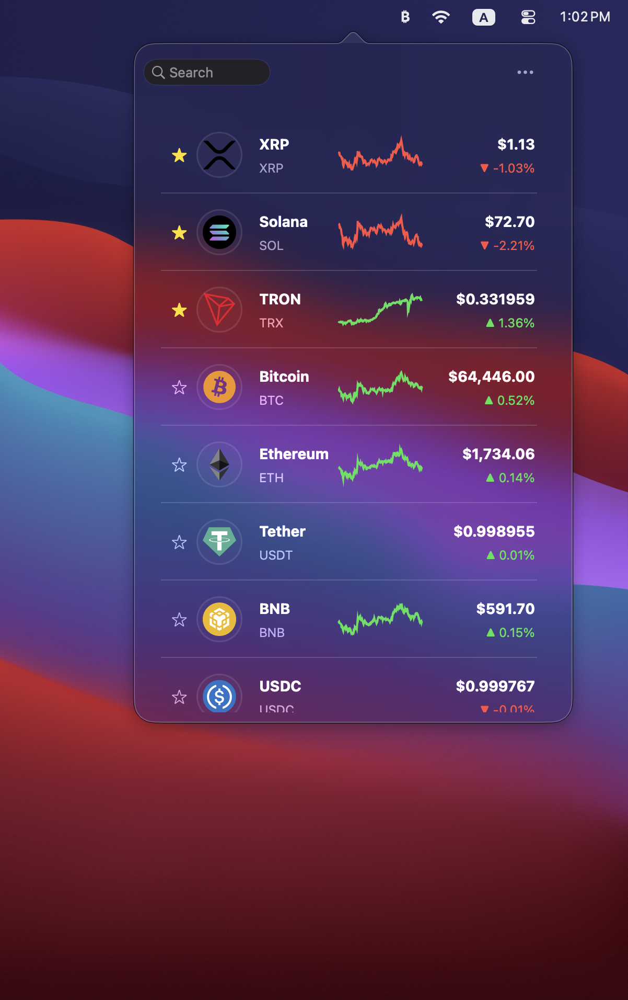
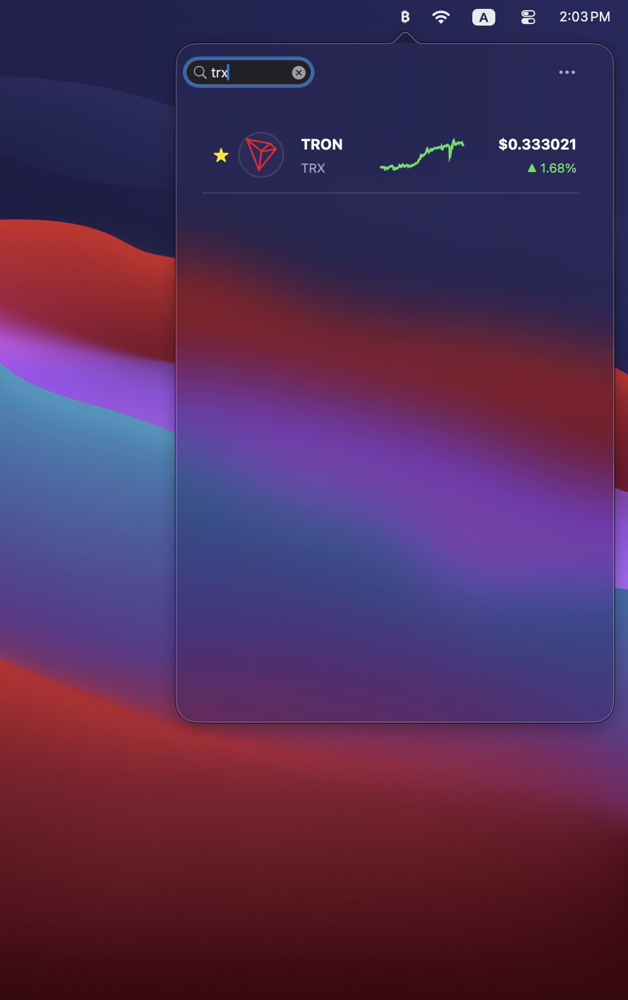

<!--
Meta description:
CryptoBar is a lightweight macOS menu bar application that displays real-time cryptocurrency prices using the CoinGecko API. It also shows 24-hour price charts for quick market trend overview directly in the menu bar.
-->

  

<h1 align="center">CryptoBar</h1>

  <b>Real-time cryptocurrency prices in your macOS menu bar</b>

  
  
  
 

---

CryptoBar is a lightweight macOS menu bar application that displays real-time cryptocurrency prices using the CoinGecko API. It also shows 24-hour price charts for quick market trend overview directly in the menu bar.

<table>
<tr>
<td>

</td>
<td>

</td>
</tr>
</table>

---

## Features

- Real-time cryptocurrency prices in macOS menu bar
- 24-hour price charts for quick trend visualization
- Lightweight and fast background operation
- Powered by CoinGecko API
- Minimal UI with focus on data clarity

## Quick Start

1. Download the latest release: https://github.com/erdwin90/crypto-bar-mac/releases/latest
2. Open the .dmg file and install the app
3. Launch CryptoBar — it will appear in your menu bar

## Usage

1. Launch `CryptoBar.app` — it appears in your menu bar
2. Click the menu bar item to see detailed prices

## Configuration

CryptoBar uses the public CoinGecko API and does not require an API key.

You can customize:

- tracked coins
- update interval
- UI layout

## Tech Stack

- Objective-C
- AppKit
- macOS Menu Bar (NSStatusItem)
- CoinGecko API

## License

MIT License. See [LICENSE](LICENSE) for details.

## Feedback

If you encounter any issues or have feature requests, please [open an issue](https://github.com/colin-nian/cryptobar/issues) on GitHub.
