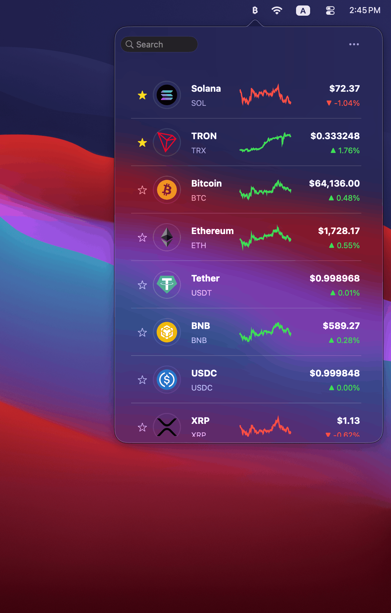

<!--
元描述：
CryptoBar 是一款轻量级 macOS 菜单栏应用，可使用 CoinGecko API 显示实时加密货币价格。它还会显示 24 小时价格图表，便于直接在菜单栏中快速查看市场趋势。
-->

<p align="center">
  
</p>

<h1 align="center">CryptoBar</h1>

<p align="center">
  <b>在 macOS 菜单栏中显示实时加密货币价格</b>
</p>


<p align="center">
  
  
  

</p>

[English](README.md) | [简体中文](README.zh-CN.md) | [日本語](README.ja.md)

---

CryptoBar 是一款轻量级 macOS 菜单栏应用，可使用 CoinGecko API 显示实时加密货币价格。它还会显示 24 小时价格图表，便于直接在菜单栏中快速查看市场趋势。


<table>
<tr>
<td>

</td>
<td>

</td>
</tr>
</table>

---

## 功能

- 在 macOS 菜单栏中显示实时加密货币价格
- 提供 24 小时价格图表，便于快速查看趋势
- 轻量、快速的后台运行
- 由 CoinGecko API 提供数据
- 简洁的界面，专注于清晰呈现数据


## 快速开始

### 选项 1 - 使用 Homebrew 安装（推荐）

```bash
brew install --cask erdwin90/cask/crypto-bar
open -a "CryptoBar"
```


### 选项 2 - 手动安装

1. 下载最新版本：https://github.com/erdwin90/crypto-bar-mac/releases/latest
2. 打开 .dmg 文件
3. 将 CryptoBar.app 拖到 /Applications
4. 启动 CryptoBar — 它会出现在菜单栏中


## 配置

CryptoBar 使用公共 CoinGecko API，不需要 API 密钥。

你可以自定义：

- 跟踪的币种
- 更新间隔
- 界面布局

## 技术栈

- Objective-C
- AppKit
- macOS 菜单栏（NSStatusItem）
- CoinGecko API

## 许可证

MIT 许可证。详情请参阅 [LICENSE](LICENSE)。


## 反馈

如果遇到问题或有功能建议，请在 GitHub 上[创建 Issue](https://github.com/colin-nian/cryptobar/issues)。
